  
  
  

---

### 🧑‍💻 Sobre mí

> ### **「 Construyo productos donde la IA no es una demo — es producción 」**

- 📫 <samp><b>Encuéntrame</b></samp> → [<kbd> 🌐 Portfolio </kbd>](https://michael-arismendi-portfolio.vercel.app) · [<kbd> 💼 LinkedIn </kbd>](https://linkedin.com/in/michael-arismendi/) · [<kbd> ✉️ Email </kbd>](mailto:michaelarismendi2@gmail.com)

### 🧰 Stack

#### <samp>⚛️ Frontend</samp>

#### <samp>⚙️ Backend</samp>

#### <samp>☁️ Cloud & DevOps</samp>

![AWS Lambda](https://img.shields.io/badge/AWS_Lambda-0d0d0d?style=for-the-badge&logo=data%3Aimage%2Fsvg%2Bxml%3Bbase64%2CPHN2ZyBmaWxsPSIjZmJiZjI0IiByb2xlPSJpbWciIHZpZXdCb3g9IjAgMCAyNCAyNCIgeG1sbnM9Imh0dHA6Ly93d3cudzMub3JnLzIwMDAvc3ZnIj48dGl0bGU%2BQVdTIExhbWJkYTwvdGl0bGU%2BPHBhdGggZD0iTTQuOTg1NSAwYy0uMjk0MS4wMDMxLS41MzM1LjI0NjYtLjUzNC41NDgyTDQuNDQ2IDUuNDU2YzAgLjE0NTEuMDYuMjgzNS4xNTkuMzg5MWEuNTMyMi41MzIyIDAgMCAwIC4zODA2LjE1NjJoMy40MjgybDguMTk3IDE3LjY4MDVhLjUzNjUuNTM2NSAwIDAgMCAuNDg4NS4zMTgxaDUuODExYy4yOTY5IDAgLjU0MjYtLjI0NDguNTQyNi0uNTQ4MlYxOC41NDRjMC0uMzAzNS0uMjM5Mi0uNTQ4Mi0uNTQyNS0uNTQ4MmgtMi4wMTM4TDEyLjczOTQuMzE1M0MxMi42NDcuMTI0IDEyLjQ1NjQgMCAxMi4yNDUyIDBoLTcuMjU0Wm0uNTM5NyAxLjA5MDdoNi4zNjc4bDguMTYgMTcuNjgwNGEuNTM2NS41MzY1IDAgMCAwIC40ODg1LjMxODFoMS44MTc4djMuODE3M0gxNy40MzdMOS4yNDAyIDUuMjI2YS41MzYuNTM2IDAgMCAwLS40ODg1LS4zMThINS41MjIzWm0yLjAxMzcgOC4yMzY2Yy0uMjA5OC4wMDExLS4zOTM3LjExOTMtLjQ4NTcuMzA5NkwuNjAwMiAyMy4yMTMzYS41NTA2LjU1MDYgMCAwIDAgLjAzMTMuNTI4Mi41MzM0LjUzMzQgMCAwIDAgLjQ1NDQuMjVoNi4xNjlhLjU0NjguNTQ2OCAwIDAgMCAuNDk3LS4zMDk2bDMuMzgtNy4xNjZhLjU0MDUuNTQwNSAwIDAgMC0uMDAyOS0uNDY4Nkw4LjAzNiA5LjYzN2EuNTQ2OC41NDY4IDAgMCAwLS40OTQyLS4zMDk2Wm0uMDA1NyAxLjgwMzYgMi40ODggNS4xNTIyLTMuMTIxNCA2LjYyMDZIMS45NDY1WiIvPjwvc3ZnPg%3D%3D)
![DynamoDB](https://img.shields.io/badge/DynamoDB-0d0d0d?style=for-the-badge&logo=data%3Aimage%2Fsvg%2Bxml%3Bbase64%2CPHN2ZyBmaWxsPSIjZmJiZjI0IiByb2xlPSJpbWciIHZpZXdCb3g9IjAgMCAyNCAyNCIgeG1sbnM9Imh0dHA6Ly93d3cudzMub3JnLzIwMDAvc3ZnIj48dGl0bGU%2BQW1hem9uIER5bmFtb0RCPC90aXRsZT48cGF0aCBkPSJNMTYuNjA2IDIwLjcwNXYtMi4zNzFjLTEuMjYzIDEuMDgyLTMuODg0IDEuNzk1LTcuMDY2IDEuNzk1LTMuMTg0IDAtNS44MDUtLjcxNC03LjA2OC0xLjc5N3YyLjM2OWMwIDEuMTY4IDIuOTAzIDIuNDcgNy4wNjggMi40NyA0LjE2IDAgNy4wNi0xLjMgNy4wNjYtMi40NjZ6bS4wMDEtNi43NjVsLjgxNy0uMDA1di4wMDVjMCAuNTE3LS4yNTguOTk4LS43NSAxLjQ0MS42MDEuNTQuNzUgMS4wNzEuNzUgMS40NDlhMTY2MS43IDE2NjEuNyAwIDAgMCAwIDMuODdjMCAxLjg4MS0zLjM4OSAzLjMtNy44ODQgMy4zLTQuNDcxIDAtNy44NDYtMS40MDQtNy44OC0zLjI3YTU4My4xMTkgNTgzLjExOSAwIDAgMS0uMDAzLTMuOTA5Yy4wMDEtLjM3NS4xNS0uOS43NDUtMS40MzctLjU5Mi0uNTM4LS43NDMtMS4wNjItLjc0Ni0xLjQzNXYtMy44OTJjLjAwMi0uMzc3LjE1My0uOTAzLjc0Ny0xLjQzOC0uNTkzLS41NC0uNzQ0LTEuMDYyLS43NDctMS40MzUgMC0xLjM1Ny0uMDAyLTIuNzM1LjAwMi0zLjg5N0MxLjY3NCAxLjQxMiA1LjA1NiAwIDkuNTQgMGMyLjE1OSAwIDQuMjMzLjM1NiA1LjY4OS45NzRsLS4zMTUuNzY2Yy0xLjM2LS41OC0zLjMxOS0uOTEtNS4zNzQtLjkxLTQuMTY1IDAtNy4wNjcgMS4zLTcuMDY3IDIuNDcgMCAxLjE2OCAyLjkwMiAyLjQ3IDcuMDY3IDIuNDcuMTE1IDAgLjIyMiAwIC4zMzQtLjAwNWwuMDMzLjgyOGMtLjEyMi4wMDYtLjI0NS4wMDYtLjM2Ny4wMDYtMy4xODQgMC01LjgwNS0uNzE0LTcuMDY4LTEuNzk4djIuMzhjLjAwNS40NS40NS44NDMuODIxIDEuMDkzIDEuMTE2LjczNiAzLjExNCAxLjIzOSA1LjM0IDEuMzQybC0uMDM3LjgyOWMtMi4yNTQtLjEwNS00LjIzLS41OS01LjUtMS4zMzItLjMxOC4yNDUtLjYyMy41NzMtLjYyMy45NTIgMCAxLjE2OCAyLjkwMiAyLjQ3IDcuMDY3IDIuNDcuNDExIDAgLjgxMi0uMDE0IDEuMjAzLS4wNDJsLjA2LjgyNmMtLjQxLjAzLS44MzMuMDQ1LTEuMjYzLjA0NS0zLjE4NCAwLTUuODA1LS43MTMtNy4wNjgtMS43OTd2Mi4zNjhjLjAwNS40NjIuNDQ5Ljg1NS44MjEgMS4xMDQgMS4yNzUuODQyIDMuNjcgMS4zNjYgNi4yNDcgMS4zNjZoLjE4MnYuODNIOS41NGMtMi42MiAwLTQuOTktLjUwNy02LjQ0NC0xLjM1OS0uMzE3LjI0NS0uNjIzLjU3NC0uNjIzLjk1NCAwIDEuMTY4IDIuOTAyIDIuNDcgNy4wNjcgMi40NyA0LjE1OSAwIDcuMDU4LTEuMjk4IDcuMDY2LTIuNDY1di0uMDA3YzAtLjM3Ny0uMzAzLS43MDUtLjYyLS45NDhhNS43MzIgNS43MzIgMCAwIDEtLjY2Mi4zMzZsLS4zMTYtLjc2NGMuMy0uMTI4LjU2LS4yNjYuNzc2LS40MTIuMzc2LS4yNTQuODIzLS42NTEuODIzLTEuMXptNC4zNzctNi45MTVoLTIuNzE3YS40MDYuNDA2IDAgMCAxLS4zMzItLjE3My40Mi40MiAwIDAgMS0uMDU1LS4zNzVsMS4yMDQtMy41OTdoLTUuNDAzbC0yLjU4MyA0Ljk3NGgyLjYyM2MuMTI4IDAgLjI0OC4wNi4zMjUuMTY0YS40MTguNDE4IDAgMCAxIC4wNjkuMzZsLTIuMjQ5IDguMzY1em0xLjI0OS0uMTI4bC0xMC44OSAxMS42MDhhLjQwOC40MDggMCAwIDEtLjQ5OC4wNzUuNDE4LjQxOCAwIDAgMS0uMTkyLS40NzFsMi41MzQtOS40MjZoLTIuNzY2YS40MDcuNDA3IDAgMCAxLS4zNDktLjIuNDE4LjQxOCAwIDAgMS0uMDEyLS40MDdsMy4wMTQtNS44MDRhLjQwOC40MDggMCAwIDEgLjM2LS4yMjJoNi4yMmMuMTMyIDAgLjI1Ni4wNjUuMzMyLjE3NGEuNDIyLjQyMiAwIDAgMSAuMDU1LjM3NGwtMS4yMDQgMy41OThoMy4xYy4xNjQgMCAuMzEuMDk5LjM3NS4yNTFhLjQyMi40MjIgMCAwIDEtLjA4LjQ1ek0zLjA4NSAyMC43MjNhOC4xMDcgOC4xMDcgMCAwIDAgMS43Mi43MmwuMjMzLS43OTRhNy4zMiA3LjMyIDAgMCAxLTEuNTQ2LS42NDV6bTEuNzItNS45ODRsLjIzMy0uNzk1YTcuMjYyIDcuMjYyIDAgMCAxLTEuNTQ2LS42NDZsLS40MDcuNzJhOC4wNTEgOC4wNTEgMCAwIDAgMS43Mi43MnptLTEuNzItNy40MjdsLjQwNy0uNzE5Yy40MTguMjQ0LjkzOS40NjIgMS41NDYuNjQ2bC0uMjMyLjc5NGE4LjA0NiA4LjA0NiAwIDAgMS0xLjcyLS43MloiLz48L3N2Zz4%3D)

#### <samp>🗄️ Datos</samp>

#### <samp>🧠 IA & LLMs</samp>

![OpenAI](https://img.shields.io/badge/OpenAI-0d0d0d?style=for-the-badge&logo=data%3Aimage%2Fsvg%2Bxml%3Bbase64%2CPHN2ZyBmaWxsPSIjYTc4YmZhIiByb2xlPSJpbWciIHZpZXdCb3g9IjAgMCAyNCAyNCIgeG1sbnM9Imh0dHA6Ly93d3cudzMub3JnLzIwMDAvc3ZnIj48dGl0bGU%2BT3BlbkFJPC90aXRsZT48cGF0aCBkPSJNMjIuMjgxOSA5LjgyMTFhNS45ODQ3IDUuOTg0NyAwIDAgMC0uNTE1Ny00LjkxMDggNi4wNDYyIDYuMDQ2MiAwIDAgMC02LjUwOTgtMi45QTYuMDY1MSA2LjA2NTEgMCAwIDAgNC45ODA3IDQuMTgxOGE1Ljk4NDcgNS45ODQ3IDAgMCAwLTMuOTk3NyAyLjkgNi4wNDYyIDYuMDQ2MiAwIDAgMCAuNzQyNyA3LjA5NjYgNS45OCA1Ljk4IDAgMCAwIC41MTEgNC45MTA3IDYuMDUxIDYuMDUxIDAgMCAwIDYuNTE0NiAyLjkwMDFBNS45ODQ3IDUuOTg0NyAwIDAgMCAxMy4yNTk5IDI0YTYuMDU1NyA2LjA1NTcgMCAwIDAgNS43NzE4LTQuMjA1OCA1Ljk4OTQgNS45ODk0IDAgMCAwIDMuOTk3Ny0yLjkwMDEgNi4wNTU3IDYuMDU1NyAwIDAgMC0uNzQ3NS03LjA3Mjl6bS05LjAyMiAxMi42MDgxYTQuNDc1NSA0LjQ3NTUgMCAwIDEtMi44NzY0LTEuMDQwOGwuMTQxOS0uMDgwNCA0Ljc3ODMtMi43NTgyYS43OTQ4Ljc5NDggMCAwIDAgLjM5MjctLjY4MTN2LTYuNzM2OWwyLjAyIDEuMTY4NmEuMDcxLjA3MSAwIDAgMSAuMDM4LjA1MnY1LjU4MjZhNC41MDQgNC41MDQgMCAwIDEtNC40OTQ1IDQuNDk0NHptLTkuNjYwNy00LjEyNTRhNC40NzA4IDQuNDcwOCAwIDAgMS0uNTM0Ni0zLjAxMzdsLjE0Mi4wODUyIDQuNzgzIDIuNzU4MmEuNzcxMi43NzEyIDAgMCAwIC43ODA2IDBsNS44NDI4LTMuMzY4NXYyLjMzMjRhLjA4MDQuMDgwNCAwIDAgMS0uMDMzMi4wNjE1TDkuNzQgMTkuOTUwMmE0LjQ5OTIgNC40OTkyIDAgMCAxLTYuMTQwOC0xLjY0NjR6TTIuMzQwOCA3Ljg5NTZhNC40ODUgNC40ODUgMCAwIDEgMi4zNjU1LTEuOTcyOFYxMS42YS43NjY0Ljc2NjQgMCAwIDAgLjM4NzkuNjc2NWw1LjgxNDQgMy4zNTQzLTIuMDIwMSAxLjE2ODVhLjA3NTcuMDc1NyAwIDAgMS0uMDcxIDBsLTQuODMwMy0yLjc4NjVBNC41MDQgNC41MDQgMCAwIDEgMi4zNDA4IDcuODcyem0xNi41OTYzIDMuODU1OEwxMy4xMDM4IDguMzY0IDE1LjExOTIgNy4yYS4wNzU3LjA3NTcgMCAwIDEgLjA3MSAwbDQuODMwMyAyLjc5MTNhNC40OTQ0IDQuNDk0NCAwIDAgMS0uNjc2NSA4LjEwNDJ2LTUuNjc3MmEuNzkuNzkgMCAwIDAtLjQwNy0uNjY3em0yLjAxMDctMy4wMjMxbC0uMTQyLS4wODUyLTQuNzczNS0yLjc4MThhLjc3NTkuNzc1OSAwIDAgMC0uNzg1NCAwTDkuNDA5IDkuMjI5N1Y2Ljg5NzRhLjA2NjIuMDY2MiAwIDAgMSAuMDI4NC0uMDYxNWw0LjgzMDMtMi43ODY2YTQuNDk5MiA0LjQ5OTIgMCAwIDEgNi42ODAyIDQuNjZ6TTguMzA2NSAxMi44NjNsLTIuMDItMS4xNjM4YS4wODA0LjA4MDQgMCAwIDEtLjAzOC0uMDU2N1Y2LjA3NDJhNC40OTkyIDQuNDk5MiAwIDAgMSA3LjM3NTctMy40NTM3bC0uMTQyLjA4MDVMOC43MDQgNS40NTlhLjc5NDguNzk0OCAwIDAgMC0uMzkyNy42ODEzem0xLjA5NzYtMi4zNjU0bDIuNjAyLTEuNDk5OCAyLjYwNjkgMS40OTk4djIuOTk5NGwtMi41OTc0IDEuNDk5Ny0yLjYwNjctMS40OTk3WiIvPjwvc3ZnPg%3D%3D)

### 🐍 Actividad

### 🏙️ Mi ciudad de contribuciones

---

☕ ¿Quieres invitarme un café? <a href="https://michael-arismendi-portfolio.vercel.app"><kbd> ☕ Visita mi portfolio </kbd></a>

